

# Tech Blog

## Week 14 Challenge

### Victor McGuire

## Table of Contents

1. [Description](#Description)
2. [Installation Instructions](#Installation-Instructions)
3. [Usage Instructions](#Usage-Instructions)
4. [Questions](#Questions)
5. [License](#License)

## Description

The purpose of this project is to create a tech blog which allows users to signup, login, add posts, update posts, delete posts, and add comments.

## Installation Instructions

Access the application here: https://vast-ocean-28047.herokuapp.com/

You can download the files: https://github.com/vmcguire/just-tech-news

Depnedencies to install via npm include: bcrypt, connect-session-sequelize, dotenv, express, express-handlebars, express-session, mysql2, and sequelize.

## Usage Instructions

### Signup or Login

Once you access the site, there may not be any posts which would mean no posts have been made. If there are any posts they will be displayed.

If you do not have a user account, click login above.

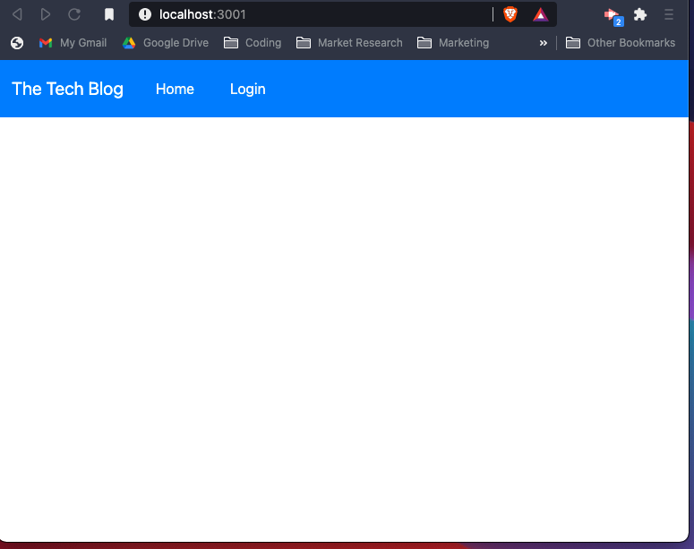

Once you click login, the screen below will be displayed. You may login if you already have an account by entering your email and password. If not move to the next screenshot.

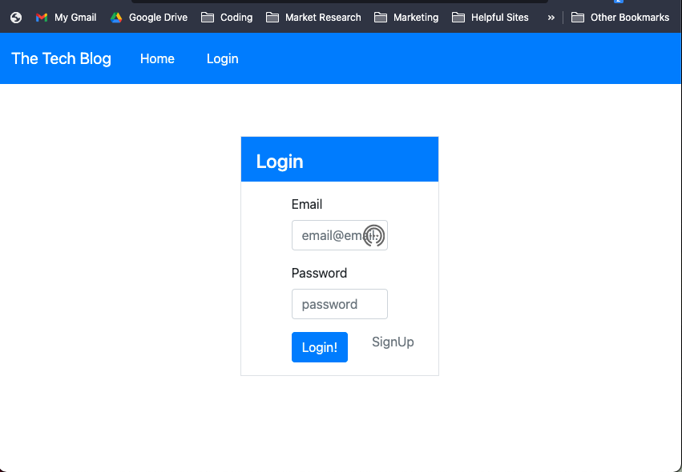

If you do not have a user account, click signup to be directed to the signup page. Input your username, email, and password.

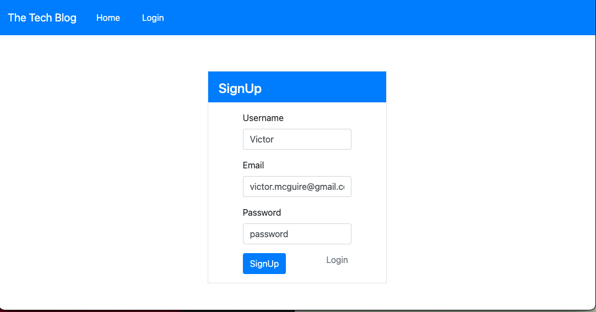

Once you login or signup, you will be directed to your dashboard page. You can always go to the dashboard by clicking your dashboard button in the top right of the page. Go ahead and create a post by clicking the New Post button.

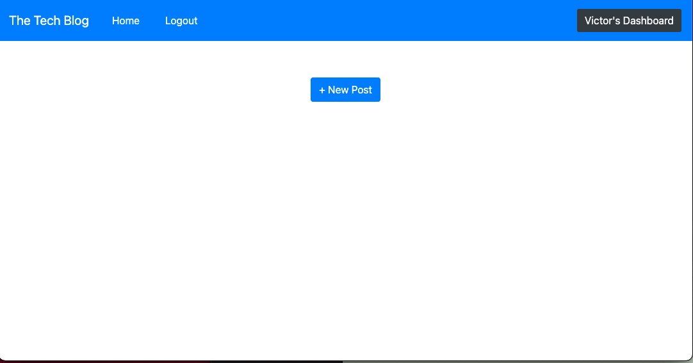

### Creating and Viewing Posts

You will be directed to this screen where you can make a post. We have input some text for demonstration purposes. Click create to move to make the post!

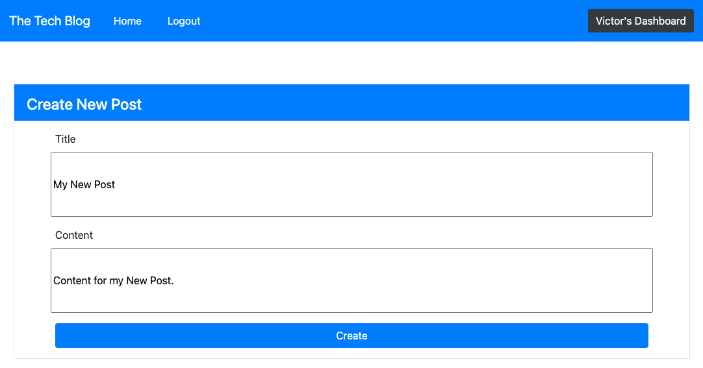

Now, in your dashboard view, you will see a list of Your Posts. We only have one here but if you make more they will show up below.

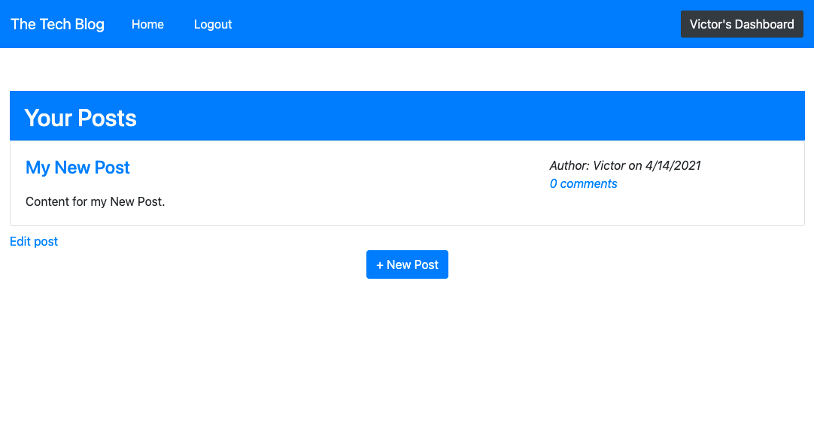

#### Edit Posts

From here, you can edit your post. You can click the post title, or the edit post button to do so. You will see here, that we have taken the liberty to make some edits to the title and content. Click Update post to make the update.

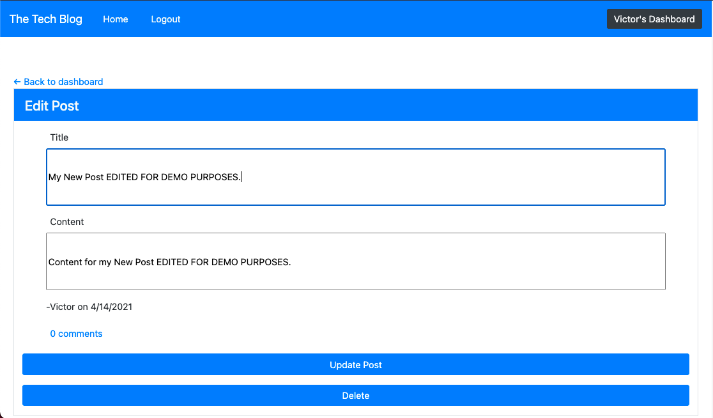

Edits will be shown in your dashboard. Let's go ahead and make a comment to the post now by clicking the title of the post, or edit post.

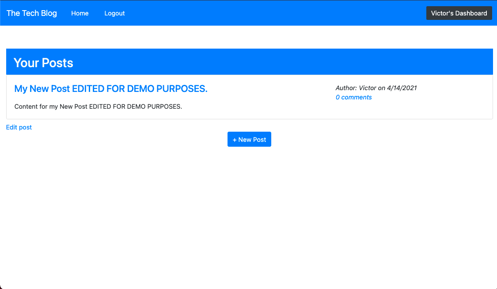

#### Adding Comments to Posts

If you scroll down in your dashboard view, you will see the Add Comment section. Here we are adding a demo comment. Go ahead and type in a comment and click Add Comment.

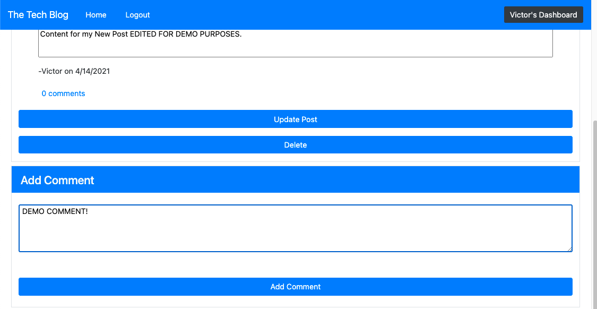

You will see your comment count in your Edit Post `(off-screen above)` is upped to 1, and below your new comment is shown.

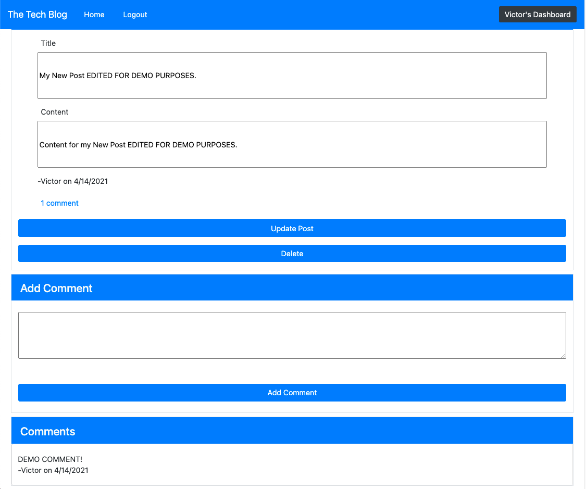

#### Deleting Posts

Let's navigate back to the dashboard to see your posts by clicking your dashboard in the top right of the screen. Let's go ahead and delete this post. Click the title or the Edit post link below the post.

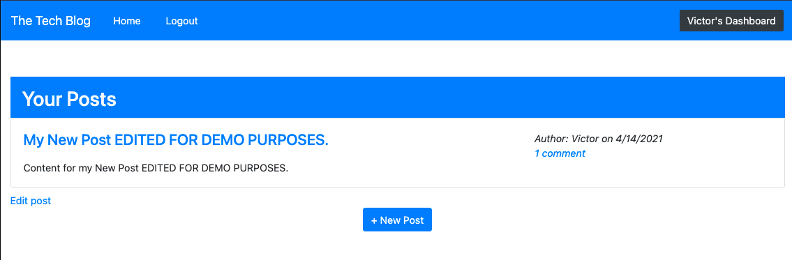

Click Delete button.

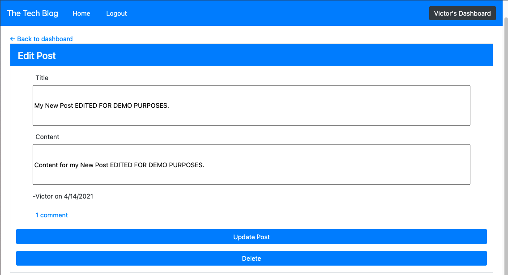

You should see this screen now.

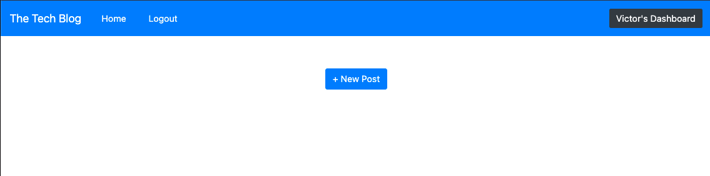

### Multiple User Interaction

Now let's take a look at commenting on other posts from other users. Here we have several posts from two different users.

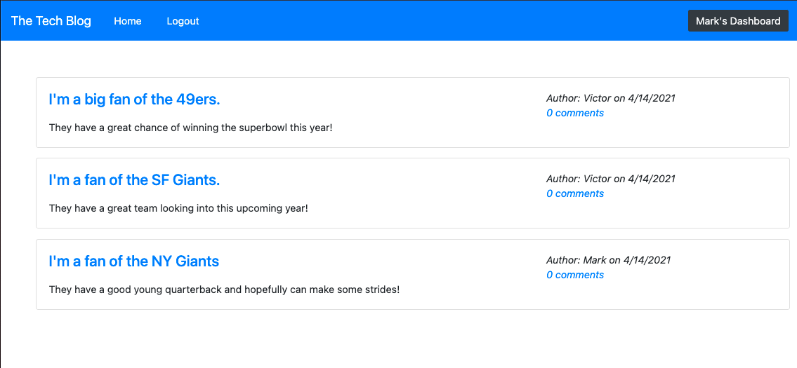

For demo purposes, I'm signed in as Mark. I see the post regarding the 49ers but I'm a NY Giants fan and I'd love to comment and adjust their perspective with some knowledge! I'm going to click on that top post.

A comment is put in and submitted by clicking Submit Comment.

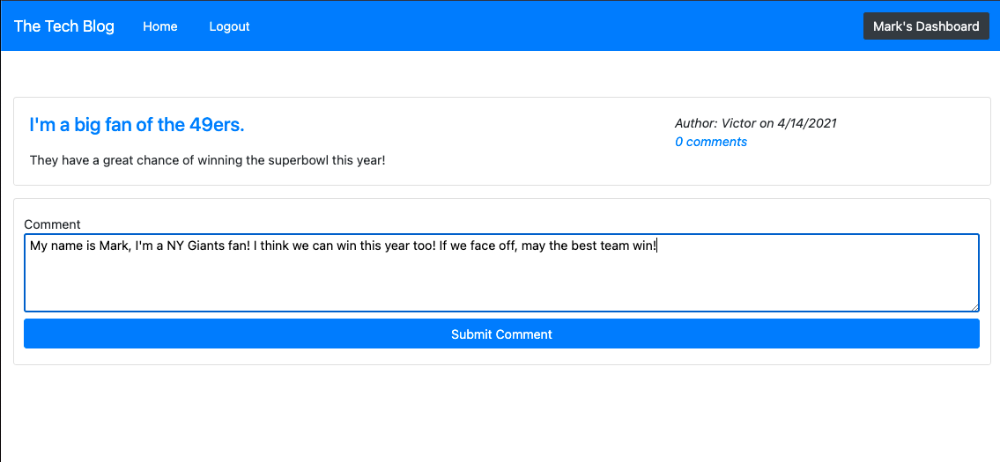

And here is the comment updated below.

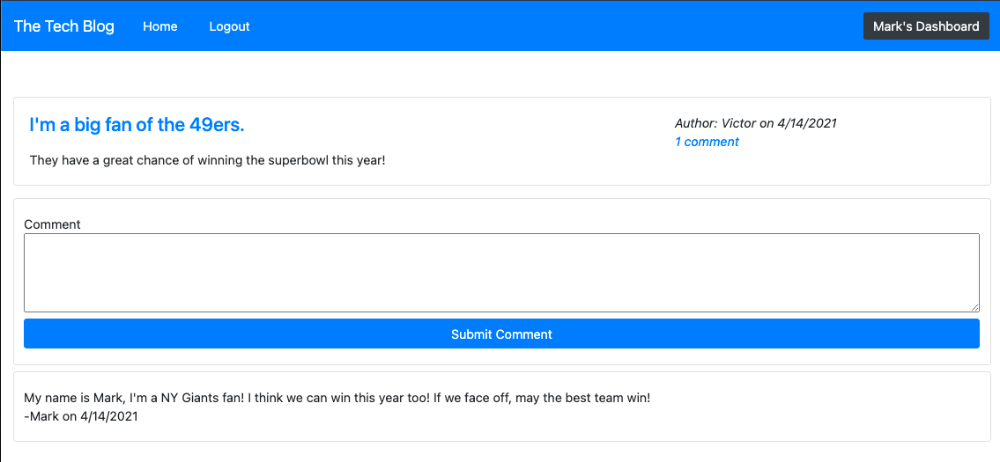

For demo purposes, we have logged in as Victor, another user,`(note we are in Victor's Dashboard now via top right of the screen)`, I notice there is 1 comment on my post. I will click that comment link to respond!

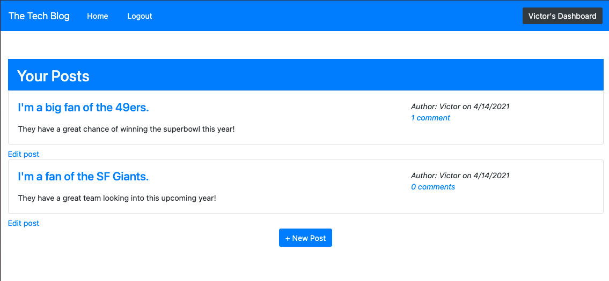

Sample comment shown below.

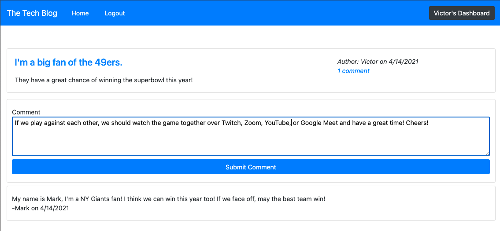

Comment displayed once submitted!

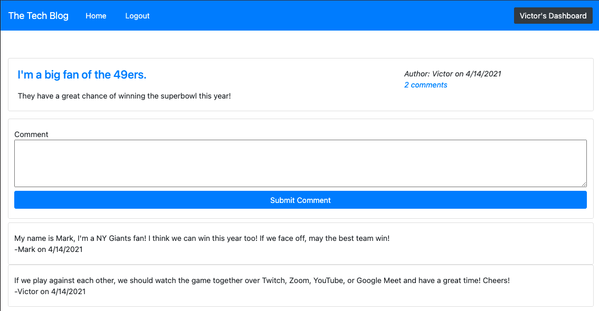

## Developer Instructions

To start the server on your local machine, execute in the command line, npm start. You will need to install the aforementioned dependencies in the [Installation Instructions](#Installation-Instructions).

## Questions

Please visit my repo here for any further questions: <https://github.com/vmcguire>

My email address is: <victor.mcguire@gmail.com>
